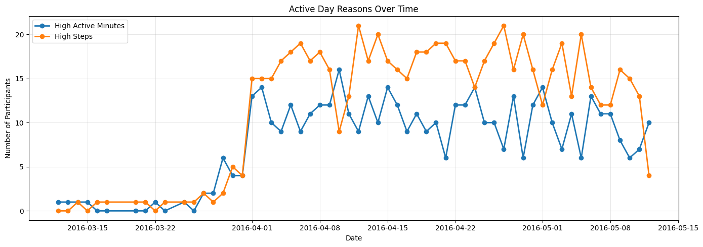
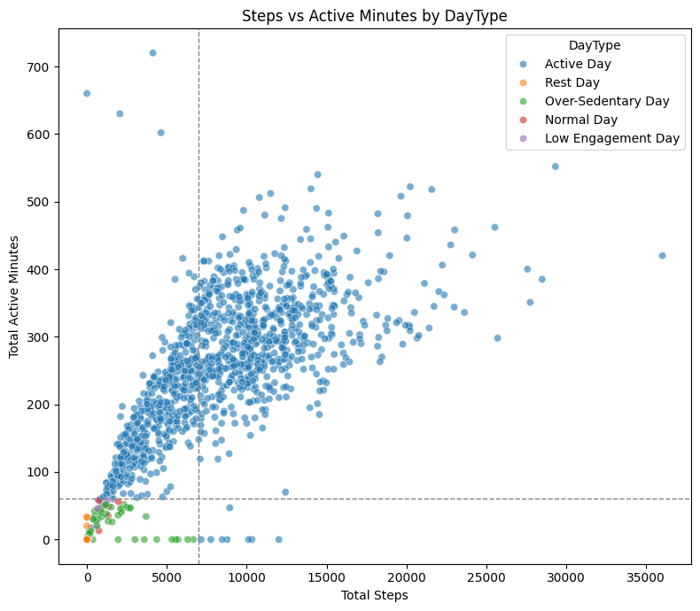

1. 개요
본 분석을 통해 사용자 활동 데이터를 기반으로 일별 활동 상태(DayType)를 정의하고,
사용자 기준 정규화(z-score) 및 상태 전이 분석을 통해 활동 패턴 변화를 탐색하였다.

2. 비즈니스 목적
- 일상 행동 변화 파악 + 맞춤형 개입이 핵심 가치
- 단순히 “얼마나 움직였는가”가 아니라 “사용자 기준에서 활동 상태는 어떻게 달라지고, 어떻게 전이되는가?”

3. 데이터 전처리 및 파생변수 정의
- TotalActiveMinutes(총 활동 시간) : VeryActiveMinutes + FairlyActiveMinutes + LightlyActiveMinutes
- Sedentary Ratio(하루동안 앉아있는 시간의 비율) : SedentaryMinutes/1440

- DayType 기준 : 
  1) Active Day : TotalSteps > 7000 and TotalActiveMinutes > 60
  2) Over-Sedentary Day : Sedentary Ratio > 0.75 and TotalSteps > 0
  3) Low Engagement Day : TotalSteps < 3000 and TotalSteps > 0 and Sedentary Ratio > 0.5
  4) Rest Day : TotalSteps == 0
  5) Normal Day : 이 이외의 구간

4. 데이터 분석 결과
4.1. 날짜별 DayType 집계
```python
import pandas as pd

act["ActivityDate"] = pd.to_datetime(act["ActivityDate"]).dt.date   # 날짜만 남김(시간 제거)
daily_counts = (
    act.groupby(["ActivityDate", "DayType"])
       .size()
       .unstack(fill_value=0)
       .sort_index()
)
daily_counts
```
각 날짜별 DayType의 수를 합계해서 정리한 결과를 EDA로 표현한 결과는 다음과 같다.



분석 결과 및 인사이트
 : Active한 상태에 더 많이 영향을 주는 것 -> high steps.(7천보 이상)
   Active Day 증감은 주로 High Steps(일상 이동량 증가)에 의해 설명되었으며, High Active Minutes는 상대적으로 안정적인 수준을 유지하였다.
   이는 활동 감소가 운동 시간의 급격한 축소보다는 일상 속 이동 감소와 더 밀접하게 관련되어 있음을 내포함.

4.2. 개인별 TotalSteps에 대해 z-score 정규화
사용자 간 기본 활동량 차이를 제거하기 위해 개인별 TotalSteps에 대해 z-score 정규화를 적용.
각자 평소 대비 얼마나 활동적인 날이었는지 확인하기
```python
# 사용자별 z-score (TotalSteps)
act["Steps_z"] = (
    act.groupby("Id")["TotalSteps"]
       .transform(lambda x: (x - x.mean()) / x.std())
)
```


0 : 그 사람의 평균적인 하루
+값 : 평소보다 꽤 활동적인 날
-값 : 평소보다 비활동적인 날

1) Active Day -> 중앙값이 0 근처 ~ 약간 위, 위쪽으로 긴 꼬리(+3~+4 이상 outlier 다수)
        : 단순히 “많이 걷는 사람들만의 날”이 아니라,
          각 사용자 기준에서도 평균 이상으로 활동적인 날임.
          ‘강도 스펙트럼’이 넓다

2) Low Engagement Day -> 중앙값이 정확히 0 아래, 분산은 비교적 작음
        : 개인 기준에서도 일관되게 낮은 활동

3) Normal Day -> 중앙값이 가장 아래쪽 (약 -2 근처), 분산도 작음
        : Nz-score 기준에서 평균 이하로 분포하지만 
          Rest Day와 달리 행동이 중단된 상태는 아니며, 
          Active 기준에 미달한 중간 활동 수준의 날로 해석

4) Over-Sedentary Day -> 중앙값은 0보다 아래, 하지만 분산이 비교적 큼
        : 중앙값은 0보다 아래
          하지만 분산이 비교적 큼
          일부 +z-score도 존재
          --> 사용자에 따라 체감이 갈리는 경계 상태

5) Rest Day -> 중앙값이 낮고 (–1.5 이하), 극단적으로 낮은 outlier 존재 (–4 이하)
        : 명확히 비활동적인 날


인사이트 
        : Over-Sedentary Day는 개인 기준에서 활동 수준의 분산이 크고, 이후 전이가 Active 또는  Rest로 모두 가능한 상태. 즉 행동 방향이 아직 고정되지 않은 경계 단계로 해석 가능.
        따라서 앱의 개입을 통해 Active 상태로 유도할 수 있는 효과적인 시점으로 보여진다.
