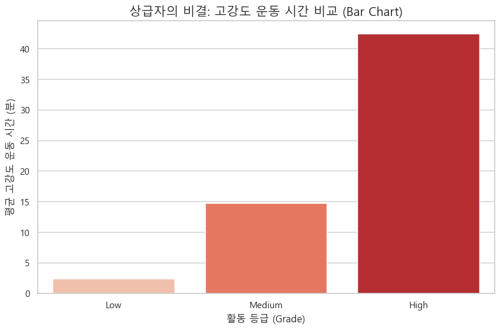
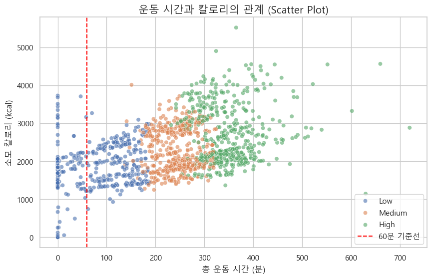

윈도우는 Ctrl + Shift + V ,맥은 Cmd + Shift + V 누르고 읽어주세용
🏃‍♂️ OHC Project: 운동 효율성 분석 및 개인화 코칭 전략 수립
(Workout Efficiency Analysis & Personalized Coaching Strategy)

1. 프로젝트 개요 (Overview)
사용자의 웨어러블 디바이스(Fitbit) 데이터를 분석하여 단순한 운동량 측정을 넘어 **'운동 효율성(Efficiency)'**이라는 새로운 핵심 지표를 정의했습니다. 이를 통해 사용자 그룹을 세분화하고, 이탈 방지 및 등급 상승을 유도하는 데이터 기반 맞춤형 피드백 시스템을 제안합니다.

데이터셋: Fitbit Daily Activity Data (dailyActivity_merged.csv)

분석 도구: Python (Pandas, Numpy, Matplotlib, Seaborn)

핵심 목표: 모든 사용자에게 똑같은 알림을 보내는 것이 아니라, **'유저의 현재 상태(효율, 패턴, 성향)'**에 맞는 1:1 코칭 메시지 도출.

2. 데이터 전처리 및 변수 정의 (Preprocessing & Feature Engineering)
원본 데이터의 한계를 보완하고 분석 목적에 맞는 파생 변수를 생성했습니다.

2.1. 데이터 정제 (Data Cleaning)
단위 변환 (Unit Conversion):

미국식 단위인 Mile을 한국 사용자에게 익숙한 Km로 변환.

(변환 계수: 1 Mile = 1.60934 Km)

이상치 제거 (Outlier Removal):

하루 총 활동 시간(Active + Sedentary)이 1440분(24시간)을 초과하는 논리적 오류 데이터 제거.

2.2. 핵심 파생변수 생성 (Feature Engineering)
운동의 '질(Quality)'을 평가하기 위해 다음과 같은 변수를 정의했습니다.

| 변수명 | 수식 / 정의 | 설명 |
| :--- | :--- | :--- |
| **Total_Active_Minutes** | `Very` + `Fairly` + `Lightly` Minutes | 총 운동(활동) 시간 합계 |
| **Intensity_Score** | (`Very`×2) + (`Fairly`×1.5) + (`Lightly`×1) | 운동 강도에 가중치를 부여한 점수 |
| **Activity_Grade** | `Intensity_Score` 기반 3분위수 (qcut) | 사용자 등급 (`Low` / `Medium` / `High`) |
| **Efficiency** | `Intensity_Score` / `Total_Active_Minutes` | **(핵심)** 분당 운동 효율성. 높을수록 짧은 시간에 고강도 운동을 수행했음을 의미. |

```python
# [Code Snippet] 전처리 및 변수 생성 로직
import pandas as pd
import numpy as np

# 데이터 로드
act = pd.read_csv('dailyActivity_merged_fin_sum.csv')
act_clean = act.copy()

# 1. 단위 변환 (Mile -> Km)
dist_cols = [col for col in act_clean.columns if 'Distance' in col]
act_clean[dist_cols] = (act_clean[dist_cols] * 1.60934).round(2)

# 2. 이상치 제거 (1440분 초과)
act_clean['Total_Minutes_Check'] = (act_clean['VeryActiveMinutes'] + act_clean['FairlyActiveMinutes'] +
                                    act_clean['LightlyActiveMinutes'] + act_clean['SedentaryMinutes'])
act_clean = act_clean[act_clean['Total_Minutes_Check'] <= 1440]

# 3. 변수 생성
act_clean['Total_Active_Minutes'] = act_clean['VeryActiveMinutes'] + act_clean['FairlyActiveMinutes'] + act_clean['LightlyActiveMinutes']
act_clean = act_clean[act_clean['Total_Active_Minutes'] > 0] # 0분 제외

# 강도 점수 및 효율성
act_clean['Intensity_Score'] = (act_clean['VeryActiveMinutes'] * 2) + (act_clean['FairlyActiveMinutes'] * 1.5) + (act_clean['LightlyActiveMinutes'] * 1)
act_clean['Efficiency'] = act_clean['Intensity_Score'] / act_clean['Total_Active_Minutes']

# 활동 등급 (Low, Medium, High)
act_clean['Activity_Grade'] = pd.qcut(act_clean['Intensity_Score'].rank(method='first'), q=3, labels=['Low', 'Medium', 'High'])
```

3. 탐색적 데이터 분석 및 시각화 (EDA & Visualization)
5가지 시각화 기법을 활용하여 사용자 패턴을 다각도로 분석했습니다.

① 현황 파악: Histogram (분포)

차트 내용: 전체 유저의 Intensity_Score 분포 (등급별 색상 구분).

분석 결과:
Low 등급은 특정 점수대에 좁게 몰려 있음 (운동 패턴이 단조로움, 걷기 위주).
High 등급은 점수 분포가 넓게 퍼져 있음 (개인별 수행 능력 편차가 큼).

인사이트: 초급자에게는 단순한 미션을, 상급자에게는 경쟁 요소를 도입해야 함.

② 가성비 분석: Box Plot (효율성 비교)

차트 내용: 등급별 Efficiency 지표의 분포 비교.

분석 결과: High 등급의 Median(중앙값)이 Low 등급보다 현저히 높음.

인사이트: 상급자는 단순히 운동을 오래 하는 것이 아니라, '같은 1분도 더 밀도 있게(고효율)' 쓴다는 것이 증명됨.

③ 격차 분석: Bar Chart (성장 요인)

차트 내용: 등급별 평균 VeryActiveMinutes(고강도 운동 시간) 비교.

분석 결과: High 등급과 Low 등급의 가장 결정적인 차이는 **고강도 운동 시간(약 10배 차이)**에서 발생함.

인사이트: 등급 상승을 위해서는 단순 걷기가 아닌 **'숨이 차는 운동'**을 유도해야 함.

④ 저효율 식별: Scatter Plot (상관관계)

차트 내용: X축(운동 시간) vs Y축(소모 칼로리).

분석 결과:
일반적으로 양의 상관관계를 보이나, **60분 이상 운동했음에도 칼로리 소모가 낮은 그룹('뚜벅이형')**이 다수 발견됨 (Red Zone).

인사이트: 이들은 '운동을 했다'는 만족감은 높으나 실제 효과는 낮음. 인터벌 트레이닝 제안이 시급함.

⑤ 수확 체감 분석: Line Plot (추세)

차트 내용: 운동 시간대별(30분 단위) 평균 Efficiency 변화 추세선.

분석 결과:
운동 시작 후 효율이 상승하다가, 약 240분을 기점으로 효율이 급격히 하락하는 '수확 체감(Diminishing Returns)' 현상 발견.

인사이트: 과도한 운동은 오히려 노동이 됨. 적절한 시점에 휴식 권고 알림이 필요함.

4. 최종 결론: 개인별 맞춤형 케어 전략 (Action Plan)
데이터 분석 결과를 바탕으로 4가지 사용자 페르소나(Persona)를 정의하고, 각 유형에 맞는 행동 유도 메시지를 설계했습니다.

| 사용자 유형 | 정의 (Data Criteria) | 진단 (Diagnosis) | 맞춤형 피드백 (Push Message 예시) |
| :--- | :--- | :--- | :--- |
| **A. 걷기 입문자**<br>(Beginner) | `Low` 등급 &<br>고강도 운동 0분 | **"강도 부족"**<br>걷기만으로는 성장이 더딤. |  *"회원님! 오늘 1시간 잘 걸으셨어요. 내일은 딱 **5분만 숨 차게** 뛰어볼까요? 상급자로 가는 지름길입니다!"* |
| **B. 뚜벅이형**<br>(Inefficient Walker) | 시간 60분 이상 &<br>칼로리 소모 하위권 | **"시간 낭비"**<br>몸이 적응해버려 효율 저하. |  *"혹시 산책 중이신가요? 같은 시간을 써도 **속도를 높이면** 칼로리가 2배! 지금 바로 템포를 올려보세요!"* |
| **C. 과유불급형**<br>(Over-training) | 시간 120분 초과 &<br>효율 하락세 진입 | **"노동 구간"**<br>지쳐서 효율이 떨어지는 중. |  *"운동 효율이 꺾이기 시작했습니다! 지금부터는 **휴식도 훈련**입니다. 오늘은 여기까지 하고 단백질 보충 하러 가시죠!"* |
| **D. 매너리즘형**<br>(Stagnant Ranker) | `High` 등급 &<br>강도 표준편차 낮음 | **"정체기"**<br>패턴이 일정해 자극이 없음. |  *"몸이 루틴을 다 외워버렸대요! 오늘은 평소 안 하던 **고강도 인터벌**로 근육을 놀래켜 줄까요? (라이벌 등장!)"* |

```python
import pandas as pd
act1 = pd.read_csv('../data/dailyActivity_ 34.csv')
act2 = pd.read_csv('../data/dailyActivity_45.csv')
combined_act = pd.concat([act1, act2], ignore_index=True)
combined_act.to_csv('dailyActivity_combined.csv', index=False)
combined_act.shape
combined_act.info()
combined_act.head()
combined_act.describe()
combined_act.isnull().sum()
combined_act.duplicated().sum()
combined_act.nunique()
```